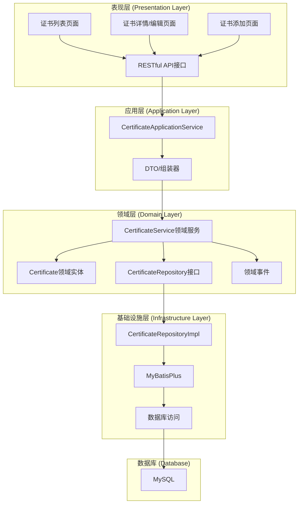
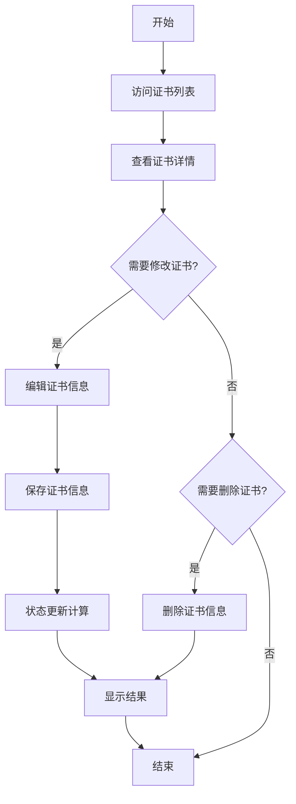
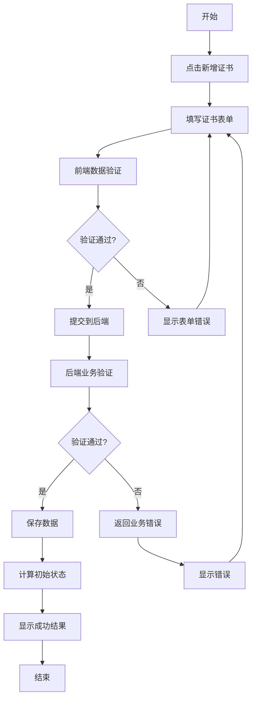
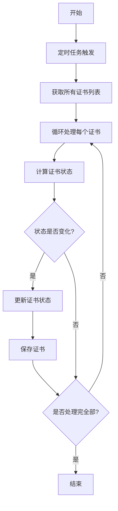
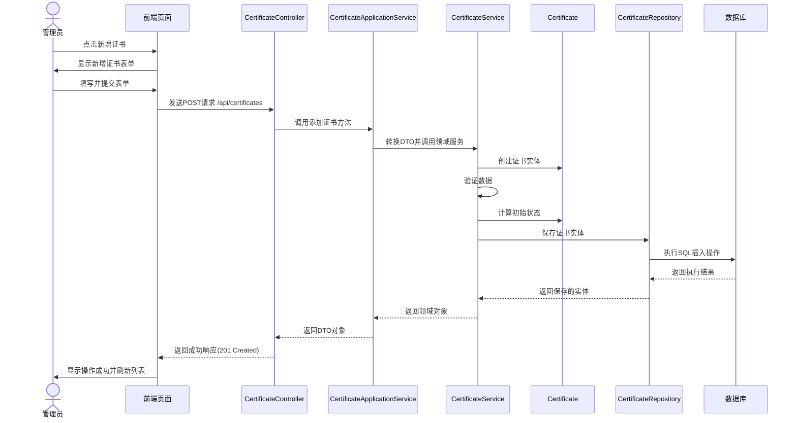
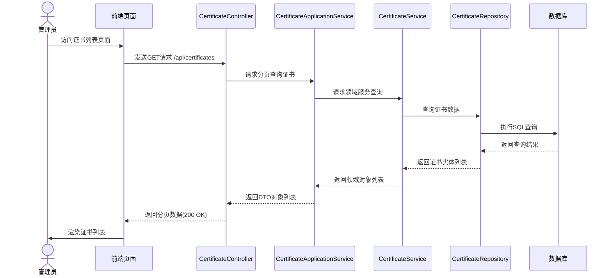
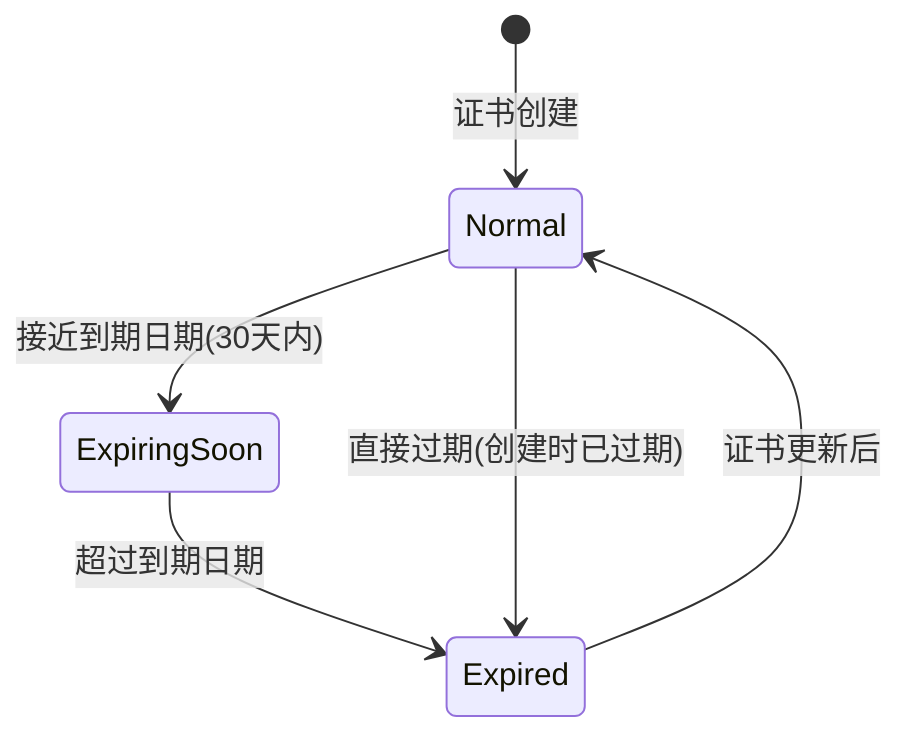
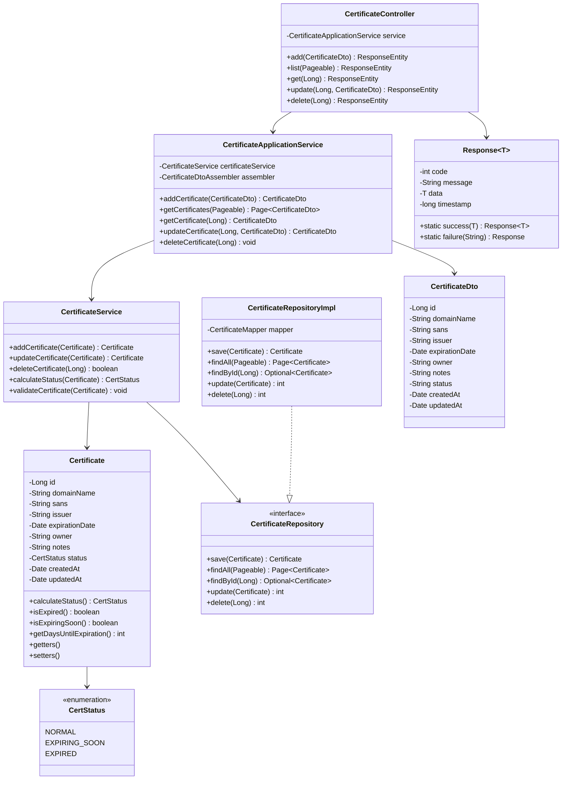
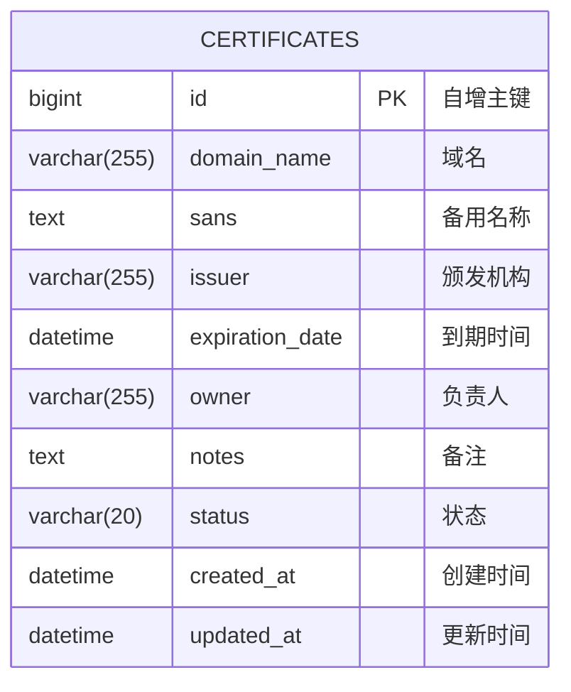

# 证书资产管理系统 - 架构设计文档

## 1. 系统架构设计

### 1.1 架构概述

证书资产管理系统采用领域驱动设计(DDD)架构模式，结合Spring Boot框架实现。系统分为表现层、应用层、领域层和基础设施层，符合DDD的分层架构思想。系统将聚焦证书的生命周期管理核心功能，包括证书的录入、查询、更新和删除操作，以及证书状态的自动计算。

### 1.2 架构图


### 1.3 开发阶段与范围:
- 初期聚焦核心功能: 证书的增删改查（录入、列表、详情、编辑、删除）、证书状态的自动计算逻辑。
- 定时任务: 实现每日一次的证书状态更新定时任务。
- 暂不包含 (初期): 用户认证与授权、单元测试、复杂查询与报表、前端界面开发。
- 开发顺序: 先完成后端核心API的开发与测试，确认稳定后再考虑前端开发。
- 部署: 初期版本在本地环境通过 java -jar 或IDE直接启动和测试。
### 1.4 数据库配置 (application.yml 示例):
```yaml
spring:
  datasource:
    driver-class-name: com.mysql.cj.jdbc.Driver
    url: jdbc:mysql://localhost:3306/cert_management?useUnicode=true&characterEncoding=utf-8&serverTimezone=Asia/Shanghai&allowPublicKeyRetrieval=true&useSSL=false # 示例中关闭SSL，生产环境按需配置
    username: root
    password: root # 注意：生产环境中应使用配置中心或环境变量等更安全的方式管理密码
  # Jackson 日期格式化配置
  jackson:
    date-format: "yyyy-MM-dd HH:mm:ss"
    time-zone: "Asia/Shanghai"
```

## 2. 核心流程图

### 2.1 证书管理核心流程



### 2.2 新增证书流程



### 2.3 证书状态更新流程



## 3. 时序图

### 3.1 新增证书时序图



### 3.2 查看证书列表时序图



## 4. 状态图

### 4.1 证书状态图



## 5. 类图



## 6. 数据库设计文档

### 6.1 ER图



### 6.2 建表DDL语句

```sql
CREATE TABLE `certificates` (
  `id` bigint(20) NOT NULL AUTO_INCREMENT COMMENT '证书ID',
  `domain_name` varchar(255) NOT NULL COMMENT '关联域名',
  `sans` text DEFAULT NULL COMMENT '备用名称(Subject Alternative Names)',
  `issuer` varchar(255) NOT NULL COMMENT '证书颁发机构',
  `expiration_date` datetime NOT NULL COMMENT '证书到期时间',
  `owner` varchar(255) NOT NULL COMMENT '证书负责人',
  `notes` text DEFAULT NULL COMMENT '备注信息',
  `status` varchar(20) NOT NULL DEFAULT 'Normal' COMMENT '证书状态: Normal, ExpiringSoon, Expired',
  `created_at` datetime NOT NULL COMMENT '创建时间',
  `updated_at` datetime NOT NULL COMMENT '最后更新时间',
  PRIMARY KEY (`id`),
  UNIQUE KEY `uk_domain_name` (`domain_name`),
  INDEX `idx_expiration_date` (`expiration_date`),
  INDEX `idx_status` (`status`)
) ENGINE=InnoDB DEFAULT CHARSET=utf8mb4 COMMENT='证书信息表';
```

## 7. API文档

### 7.1 统一响应格式

所有API响应均采用以下统一格式：

```json
{
  "code": 200,       // 状态码，200表示成功，非200表示失败
  "message": "成功",  // 响应消息
  "data": {},        // 响应数据，可能是对象、数组或null
  "timestamp": 1620000000000  // 时间戳
}
```

常见状态码：
- 200: 成功
- 400: 请求参数错误
- 404: 资源不存在
- 500: 服务器内部错误

### 7.2 RESTful API设计

#### 证书管理API

| HTTP方法 | 路径 | 说明 | 请求参数 | 响应状态码 |
|---------|-----|------|---------|-----------|
| GET | /api/certificates | 获取证书列表 | page, size, sort | 200 |
| GET | /api/certificates/{id} | 获取单个证书详情 | id | 200, 404 |
| POST | /api/certificates | 添加新证书 | 证书JSON | 201, 400 |
| PUT | /api/certificates/{id} | 更新证书信息 | id, 证书JSON | 200, 400, 404 |
| DELETE | /api/certificates/{id} | 删除证书 | id | 204, 404 |

### 7.3 API详细说明

#### 7.3.1 获取证书列表

- **URL:** `/api/certificates`
- **方法:** `GET`
- **描述:** 返回证书列表，支持分页和排序
- **请求参数:**
    - `page`: 页码，默认0
    - `size`: 每页记录数，默认10
    - `sort`: 排序字段，默认expiration_date,asc
- **响应:**
  ```json
  {
    "code": 200,
    "message": "成功",
    "data": {
        "records": [
            {
                "id": 1,
                "domainName": "example.com111",
                "sans": "www.example.com,api.example.com",
                "issuer": "Let's Encrypt",
                "expirationDate": "2025-07-05 09:11:43",
                "owner": "张三",
                "notes": "测试证书1",
                "status": null,
                "createdAt": "2025-05-06 09:11:43",
                "updatedAt": "2025-05-07 11:32:59"
            }
        ],
        "total": 7,
        "size": 10,
        "current": 1,
        "pages": 1
    },
    "timestamp": 1747983967830
}
  ```

#### 7.3.2 获取证书详情

- **URL:** `/api/certificates/{id}`
- **方法:** `GET`
- **描述:** 返回指定ID的证书详细信息
- **响应成功:**
  ```json
  {
    "code": 200,
    "message": "成功",
    "data": {
      "id": 1,
      "domainName": "example.com",
      "sans": "www.example.com,api.example.com",
      "issuer": "Let's Encrypt",
      "expirationDate": "2023-12-31T23:59:59",
      "owner": "张三",
      "notes": "测试证书",
      "status": "Normal",
      "createdAt": "2023-01-01T10:00:00",
      "updatedAt": "2023-01-01T10:00:00"
    },
    "timestamp": 1620000000000
  }
  ```
- **响应失败:**
  ```json
  {
    "code": 404,
    "message": "证书不存在",
    "data": null,
    "timestamp": 1620000000000
  }
  ```

#### 7.3.3 添加新证书

- **URL:** `/api/certificates`
- **方法:** `POST`
- **描述:** 创建新的证书记录
- **请求体:**
  ```json
  {
    "domainName": "example.com",
    "sans": "www.example.com,api.example.com",
    "issuer": "Let's Encrypt",
    "expirationDate": "2023-12-31T23:59:59",
    "owner": "张三",
    "notes": "测试证书"
  }
  ```
- **响应成功:**
  ```json
  {
    "code": 200,
    "message": "创建成功",
    "data": {
      "id": 1,
      "domainName": "example.com",
      "sans": "www.example.com,api.example.com",
      "issuer": "Let's Encrypt",
      "expirationDate": "2023-12-31T23:59:59",
      "owner": "张三",
      "notes": "测试证书",
      "status": "Normal",
      "createdAt": "2023-01-01T10:00:00",
      "updatedAt": "2023-01-01T10:00:00"
    },
    "timestamp": 1620000000000
  }
  ```
- **响应失败:**
  ```json
  {
    "code": 400,
    "message": "域名格式不正确",
    "data": null,
    "timestamp": 1620000000000
  }
  ```

#### 7.3.4 更新证书信息

- **URL:** `/api/certificates/{id}`
- **方法:** `PUT`
- **描述:** 更新现有的证书记录
- **请求体:**
  ```json
  {
    "domainName": "example.com",
    "sans": "www.example.com,api.example.com,new.example.com",
    "issuer": "Let's Encrypt",
    "expirationDate": "2024-12-31T23:59:59",
    "owner": "李四",
    "notes": "已更新的测试证书"
  }
  ```
- **响应成功:**
  ```json
  {
    "code": 200,
    "message": "更新成功",
    "data": {
      "id": 1,
      "domainName": "example.com",
      "sans": "www.example.com,api.example.com,new.example.com",
      "issuer": "Let's Encrypt",
      "expirationDate": "2024-12-31T23:59:59",
      "owner": "李四",
      "notes": "已更新的测试证书",
      "status": "Normal",
      "createdAt": "2023-01-01T10:00:00",
      "updatedAt": "2023-01-02T11:00:00"
    },
    "timestamp": 1620000000000
  }
  ```

#### 7.3.5 删除证书

- **URL:** `/api/certificates/{id}`
- **方法:** `DELETE`
- **描述:** 删除指定ID的证书记录
- **响应成功:**
  ```json
  {
    "code": 200,
    "message": "删除成功",
    "data": null,
    "timestamp": 1620000000000
  }
  ```
- **响应失败:**
  ```json
  {
    "code": 404,
    "message": "证书不存在",
    "data": null,
    "timestamp": 1620000000000
  }
  ```

## 8. 技术实现要点

### 8.1 状态计算逻辑

证书状态计算是核心功能之一，实现逻辑如下：

```java
public CertStatus calculateStatus(Certificate certificate) {
    LocalDate today = LocalDate.now();
    LocalDate expirationDate = certificate.getExpirationDate().toInstant()
            .atZone(ZoneId.systemDefault()).toLocalDate();
    
    if (today.isAfter(expirationDate)) {
        return CertStatus.EXPIRED;
    }
    
    // 配置为30天内过期视为即将过期
    LocalDate warnDate = expirationDate.minusDays(30);
    if (today.isAfter(warnDate) || today.isEqual(warnDate)) {
        return CertStatus.EXPIRING_SOON;
    }
    
    return CertStatus.NORMAL;
}
```

### 8.2 定时任务配置

使用Spring的`@Scheduled`注解实现证书状态定时更新：

```java
@Component
public class CertificateStatusUpdateTask {
    
    private final CertificateService certificateService;
    
    public CertificateStatusUpdateTask(CertificateService certificateService) {
        this.certificateService = certificateService;
    }
    
    @Scheduled(cron = "0 0 1 * * ?") // 每天凌晨1点执行
    public void updateCertificateStatus() {
        certificateService.updateAllCertificatesStatus();
    }
}
```
